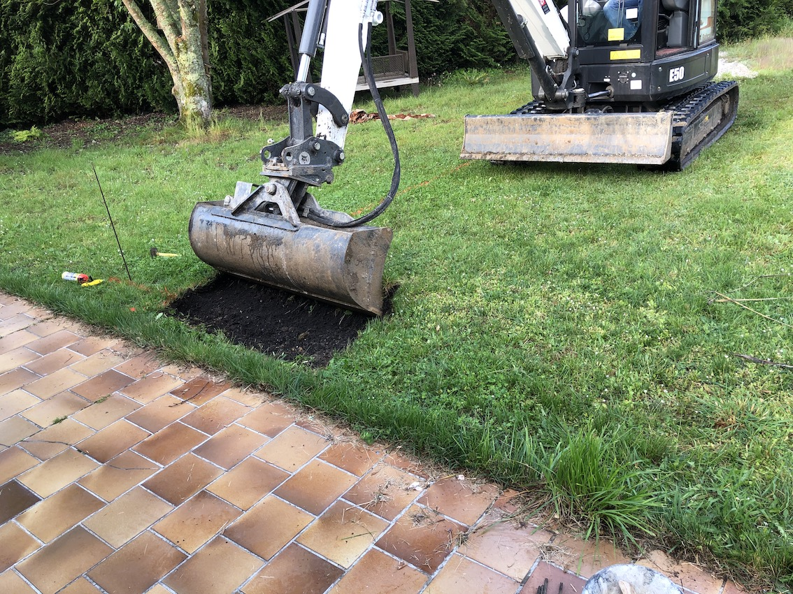

Het grote avontuur is begonnen: de aanleg van het zwembad. Hier gaan we het hebben over het **gat**.

<!--more-->

De afspraak was om 8:30 op maandag 20 mei 2019. Groot was mijn verbazing toen
de hond blafte rond 8 uur. Ik las de Volkskrant in bed want het
spreekwoordelijke Franse kwartiertje zou ik wel hebben, dacht ik zo, Hoe kun
je je vergissen. Nee dus, snel aangekleed en de werklui (3 man sterk, sorry
dames dit is echt een mannenvak) ontvangen, met koffie en speculaas
natuurlijk. Dit was de toestand voor ze begonnen:  

En dit na de eerste actie:  

Niks Franse slag, want keurig ruimen ze het zand op door het in een
vrachtwagen te laden (en verkopen dat weer door, maar onze zegen hebben ze):
 

Later op de dag is het al flink gevorderd: 

En dit is het **gat** na de eerste dag: 

